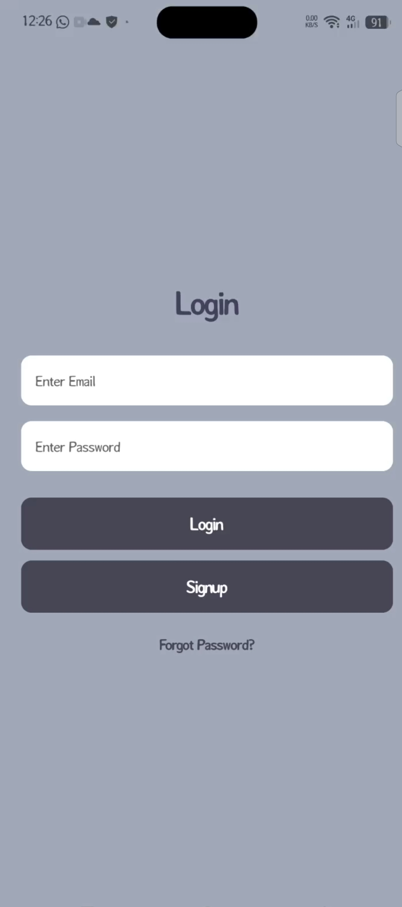
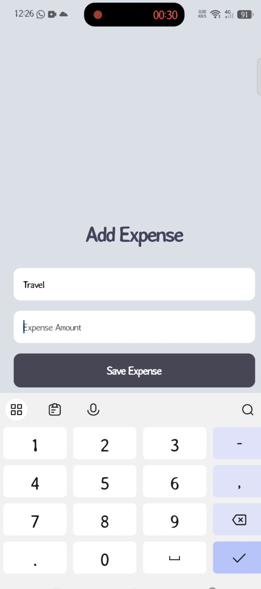
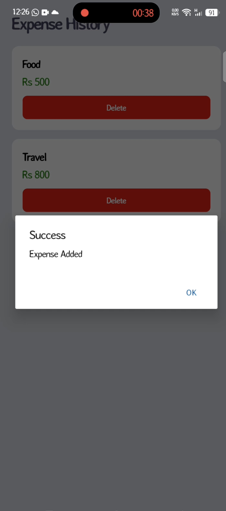
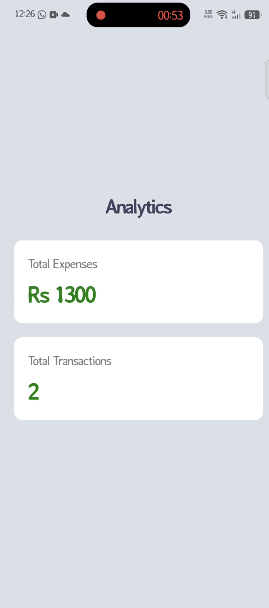
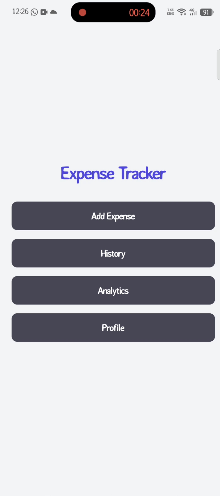
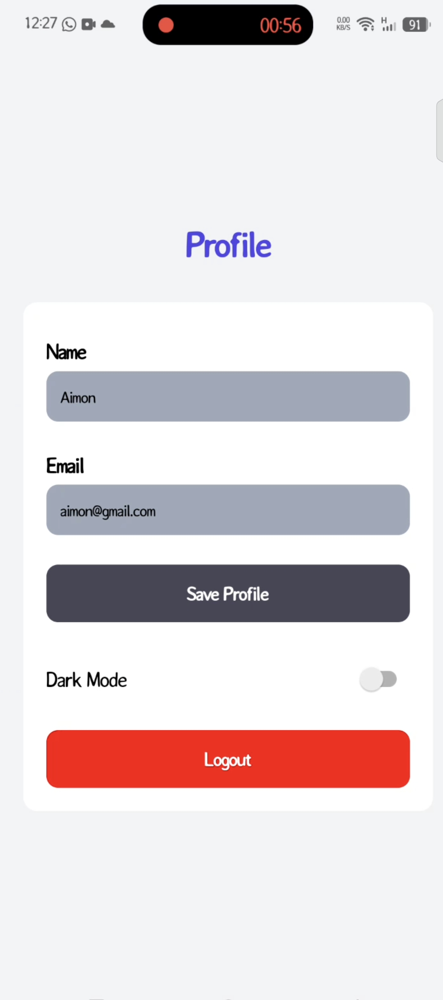

# 💰 Expense Tracker App

A modern and user-friendly **Expense Tracker mobile application** built with **React Native and Expo**. This app helps users manage their income and expenses through a clean, intuitive, and responsive mobile interface.

## ✨ Features

* 🔐 User authentication screens
* 💰 Track income and expenses
* ➕ Add new expenses
* ✏️ Edit expense information
* 🗑️ Delete expenses
* 📊 View expense history
* 📈 Analytics and financial overview
* 👤 User profile management
* 🌙 Dark mode support
* 📱 Mobile-friendly interface
* 🎨 Clean and modern UI
* ⚡ Built with Expo for cross-platform development

## 🛠️ Tech Stack

* **React Native** – Mobile application development
* **Expo** – Development and build platform
* **TypeScript** – Type-safe development
* **React** – Component-based UI
* **Expo Router** – File-based navigation
* **React Hooks** – State and component logic

## 📂 Project Structure

```text
Expense-Tracker-App/
│
├── app/
│   ├── _layout.tsx
│   ├── index.tsx
│   ├── login.tsx
│   ├── signup.tsx
│   ├── home.tsx
│   ├── addexpense.tsx
│   ├── history.tsx
│   ├── analytics.tsx
│   └── profile.tsx
│
├── assets/
│   └── images/
│
├── components/
│
├── constants/
│
├── context/
│
├── hooks/
│
├── scripts/
│
├── app.json
├── package.json
├── tsconfig.json
└── README.md
```

## 🚀 Getting Started

### 1. Clone the repository

```bash
git clone https://github.com/aimonarshad803-cyber/Expense-Tracker-App.git
```

### 2. Navigate to the project

```bash
cd Expense-Tracker-App
```

### 3. Install dependencies

```bash
npm install
```

### 4. Start the Expo development server

```bash
npx expo start
```

### 5. Run the application

You can open the project using:

* 📱 Expo Go
* 🤖 Android Emulator
* 🍎 iOS Simulator
* 🌐 Web Browser

## 📸 Screenshots

### 🔐 Login

### ➕ Add Expense

### 📜 History

### 📊 Analytics

### 🏠 Home

### 👤 Profile


## 🎯 Main Screens

### 🔐 Login & Sign Up

Users can access the application through dedicated authentication screens.

### 🏠 Home

Provides an overview of the user's financial activity and current balance.

### ➕ Add Expense

Allows users to add new expense records.

### 📜 History

Displays previously added transactions and expenses.

### 📊 Analytics

Provides a visual overview of spending and financial activity.

### 👤 Profile

Allows users to manage their profile and application preferences, including dark mode.

## 📚 What I Learned

Through this project, I practiced:

* React Native development
* Expo workflow
* TypeScript
* Component-based architecture
* File-based routing with Expo Router
* React Hooks
* Mobile UI/UX design
* State management
* Form handling
* Navigation between screens
* Building responsive mobile interfaces

## 🚀 Future Improvements

* ☁️ Cloud database integration
* 🔔 Expense reminders and notifications
* 📤 Export financial reports
* 🔎 Advanced transaction search and filtering
* 📅 Monthly and yearly financial reports
* 📊 More advanced charts and analytics
* 🔐 Secure authentication and cloud synchronization

## 👩‍💻 Author

**Aimon Arshad**

Frontend & React Native Developer

Currently learning and building projects with React.js, React Native, and the MERN Stack.

---

⭐ If you found this project interesting, consider giving it a star!

